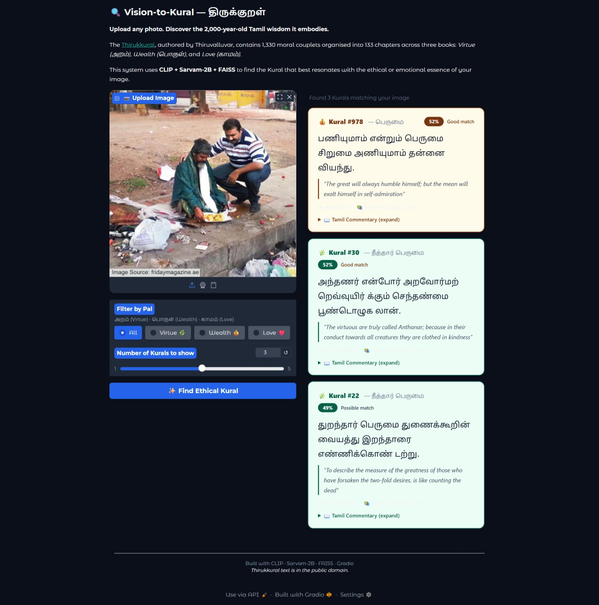

# Vision-to-Kural - திருக்குறள்

**Upload any photo. Discover the 2,000-year-old Tamil wisdom it embodies.**

### What it does

Upload any photograph. The system finds the Thirukkural couplet whose **ethical essence** best matches the scene - moving AI from pure **object detection** into **value judgment**.

| Scene | Retrieved Kural | Why it matches |
|-------|----------------|----------------|
| A parent watching their child play | *Kural #63 - Makkatperu (Children)* | Parent-child bond as true wealth |
| Friends laughing and helping each other | *Kural #786 - Natpu (Friendship)* | The joy and duty of deep friendship |
| A person meditating alone | *Kural #350 - Thuravu (Renunciation)* | Solitude and detachment from desire |
| A couple separated by distance | *Kural #1295 - Pirividaral (Separation)* | The paradox of love and longing |
| Someone speaking gently to another | *Kural #93 - Insol (Kind Words)* | The power of gentle speech |

---

### About the Thirukkural

The **Thirukkural** (திருக்குறள்), composed by **Thiruvalluvar** (~2nd century BCE), is one of the most translated texts in the world and is considered
the moral backbone of Tamil civilisation. It contains **1,330 couplets** across **133 chapters** in three main sections:

| Pal | Tamil | Scope |
|-----|-------|-------|
| Virtue | அறத்துப்பால் | Ethics, family, righteous conduct |
| Wealth | பொருட்பால் | Governance, economics, character |
| Love | காமத்துப்பால் | Romance, longing, union |

---
### How it works
1. Your image is encoded by **CLIP ViT-L/14** → 768-dim vector
2. A trained **MLP** projects it into a 512-dim shared ethical space
3. **FAISS** searches 1,330 Kural vectors and returns the top matches
4. Results show Tamil text, transliteration, English meaning, and commentary

### Models
- `openai/clip-vit-large-patch14` - image encoding (runs live)
- `sarvamai/sarvam-2b-v0.5` - Tamil text encoding (offline, pre-indexed)

### Screenshot



---

### Contributing

Contributions welcome! Priority areas:

1. **Image annotations** - annotate image-Kural pairs and open a PR
2. **UI improvements** - transliteration, audio, better card layout  
3. **Evaluation** - more diverse test scenes, human evaluation by Tamil speakers
4. **Alternative encoders** - test IndicBERT, MuRIL, or ai4bharat models

Please open an issue before starting large changes.

---

### License

- Thirukkural text: **public domain** (composed ~2nd century CE)
- CLIP weights: [OpenAI Research License](https://github.com/openai/CLIP/blob/main/LICENSE)
- Sarvam-2B weights: [Sarvam AI License](https://huggingface.co/sarvamai/sarvam-2b-v0.5)

---

### Citation

```bibtex
@software{vision_to_kural_2026,
  title   = {Vision-to-Kural: Ethical Image Captioning using Thirukkural},
  author  = {Birashalynee S},
  year    = {2026},
  url     = {https://github.com/Shaliinii28/vision-to-kural},
  note    = {CLIP + Sarvam-2B + FAISS pipeline for mapping visual scenes
             to the moral philosophy of the Thirukkural}
}
```

---

<div align="center">

*"பொய்யாமை பொய்யாமை ஆற்றின் அறம்பிற செய்யாமை செய்யாமை நன்று"*

*"If one can keep to the path of truthfulness, there is no need for other virtues."*

~ **Kural 297**

<br/>
Built with ❤️ using CLIP · Sarvam-2B · FAISS · Gradio

</div>
